# Cargo Chat 🦀💬

**AI-powered code search and Q&A for your repositories**

Cargo Chat helps you understand and navigate codebases using natural language. Ask questions about your code and get intelligent answers backed by semantic search and AI analysis.

## How does Cargo chat work?

### Indexing Phase (Happens Once)

**Step 1: Repository Scanning**

Walks through your codebase using ignore crate (respects .gitignore)
Identifies supported file types (Rust, Python, JS, etc.)

**Step 2: Smart Chunking**

Uses tree-sitter parsers for each language to understand code structure
Splits files into semantic chunks (functions, classes, modules) rather than arbitrary line breaks
Each chunk knows its file path, language, and context

**Step 3: Embedding Generation**

Converts each code chunk into a high-dimensional vector using embedding models (Jina or Qwen3)
These vectors capture semantic meaning, not just text similarity

**Step 4: Vector Index Building**

Creates an ANN (Approximate Nearest Neighbor) index for fast similarity search
Stores chunk metadata alongside vectors

### 🔍 Query Phase (Every Time You Ask)

**Step 1: Query Processing**

You type: "How does authentication work?"

**Step 2: HyDE (Hypothetical Document Embeddings)**

AI generates hypothetical code snippets that would answer your question
Example: Generates fake auth functions, middleware patterns, token validation code
These hypothetical documents become search targets

**Step 3: Intent Classification**

Analyzes your query to understand:
Do you want code implementation or conceptual explanation?
Which programming language?
Any folder/file filters? ("only in src", "exclude tests")
What's your primary intent? (debugging, learning, finding examples)

**Step 4: Vector Search**

Converts your query + hypothetical documents to vectors
Searches the index for semantically similar code chunks
Returns top candidates based on cosine similarity

**Step 5: Reranking**

Uses Jina reranker model to re-score and re-order results
Considers both semantic similarity and query-specific relevance
Filters results based on detected intent and preferences

**Step 6: Context Assembly**

Selects the best chunks based on reranking scores
Applies any folder/extension filters from intent classification
Assembles relevant code snippets with file paths and context

**Step 7: AI Response Generation**

Sends assembled context + original query to OpenAI
Uses role-based prompts adapted to your intent (code expert, educator, debugger)
Streams back intelligent answer with code examples and explanations
The magic is that each step gets smarter - HyDE improves search relevance, intent classification customizes the response, and reranking ensures you get the most relevant code for your specific question.

## 🏗️ System Architecture

```mermaid
graph TD
    %% Indexing Phase
    subgraph "📚 INDEXING PHASE (One Time)"
        A[Repository Scanning<br/>Walk codebase, identify file types] --> B[Smart Chunking<br/>Tree-sitter parsers split by functions/classes]
        B --> C[Embedding Generation<br/>Convert chunks to vectors<br/>Jina/Qwen3 models]
        C --> D[Vector Index Building<br/>ANN index + metadata storage]
    end
    
    %% Query Phase
    subgraph "🔍 QUERY PHASE (Every Query)"
        E[User Query<br/>How does authentication work?] --> F[HyDE Processing<br/>Generate hypothetical code snippets<br/>that would answer the query]
        F --> G[Intent Classification<br/>• Code vs explanation?<br/>• Target language?<br/>• Folder filters?<br/>• Primary intent?]
        G --> H[Vector Search<br/>Query + hypothetical docs → vectors<br/>Search index for similar chunks]
        H --> I[Reranking<br/>Jina reranker re-scores results<br/>for query-specific relevance]
        I --> J[Context Assembly<br/>Select best chunks<br/>Apply filters from intent]
        J --> K[AI Response Generation<br/>OpenAI + role-based prompts<br/>Stream intelligent answer]
    end
    
    %% Connection between phases
    D -.->|Provides search index| H
    
    %% Styling
    style A fill:#e3f2fd
    style B fill:#f3e5f5
    style C fill:#fff3e0
    style D fill:#e8f5e8
    style F fill:#fff9c4
    style G fill:#fce4ec
    style I fill:#fff3e0
    style K fill:#e8f5e8
```



**Key Technologies:**
- **Tree-sitter**: Language-aware code parsing and chunking
- **HyDE**: Hypothetical Document Embeddings for better search relevance
- **Vector Embeddings**: Semantic code representation using Jina/Qwen3 models
- **Reranking**: Query-specific relevance scoring with Jina reranker
- **Intent Classification**: AI-powered query understanding and response adaptation

## ✨ What Can You Do?

- **Ask questions about your codebase** in plain English
- **Search across multiple programming languages** (Rust, JavaScript, TypeScript, Java, C++, Python, and more)
- **Get context-aware answers** that understand your specific code
- **Interactive chat mode** for exploring codebases efficiently
- **Smart code retrieval** that finds relevant code snippets automatically

## 🧠 Intent-Aware Search

Cargo Chat features an advanced **intent-aware search system** that understands what you're looking for and adapts its responses accordingly:

### 🎯 Smart Query Classification

- **Automatic Intent Detection**: Recognizes whether you want implementation details, explanations, debugging help, or architectural overviews
- **Language-Aware Filtering**: Detects target programming languages from your queries and prioritizes relevant files
- **Confidence-Based Results**: Uses AI confidence scoring to determine the best mix of code and documentation

### 📁 Advanced Filtering Capabilities

- **Folder-Specific Search**: `"search in src folder"` or `"look in tests/"` to target specific directories
- **Extension-Based Filtering**: `"only .rs files"` or `"show me Python code"` to focus on specific file types
- **Exclusion Patterns**: `"exclude tests"` or `"skip target folder"` to remove unwanted results
- **Combined Filtering**: `"Rust files in src folder excluding tests"` for precise targeting

### 🤖 Intelligent Response Generation

- **Role-Based Prompts**: System adapts as a code expert, senior developer, technical educator, or debugging specialist based on your query
- **Intent-Specific Responses**:
  - **"How does X work?"** → Architectural explanations with code examples
  - **"Show me the implementation of Y"** → Direct code focus with minimal documentation
  - **"Debug this error"** → Problem-solving approach with relevant code context
  - **"Explain this concept"** → Educational responses with theory and practice

### 💡 Example Queries

```bash
# Intent: Implementation focus
query "How does the Hyde algorithm work in this Rust codebase?"

# Intent: Folder-specific search
query "Show me error handling patterns in the src folder"

# Intent: Language and exclusion filtering
query "Find authentication code in Python files, exclude tests"

# Intent: Debugging assistance
query "Why might this function be returning None?"
```

## 🚀 Quick Start

### Prerequisites

- **Rust** (latest stable version)
- **OpenAI API Key** (set as `OPENAI_API_KEY` environment variable)
  - Get one at [OpenAI's website](https://platform.openai.com/api-keys)
- That's it! Embedding models download automatically on first use.

### Installation

```bash
# Clone the repository
git clone <repository-url>
cd cargo-chat

# Build the application
cargo build --release

# Optional: Enable command history (saves your commands)
cargo build --release --features with-file-history
```

## 💡 How to Use

### Step 1: Start Interactive Mode

```bash
# Set your OpenAI API key
export OPENAI_API_KEY="your-api-key-here"

# Start cargo-chat
./target/release/cargo_chat interactive
```

### Step 2: Index Your Codebase

```bash
# Inside cargo-chat, index your project
index --repo /path/to/your/project --out ./my_project_index
```

### Step 3: Ask Questions

```bash
# Ask about your code
query "How does authentication work in this codebase?"
query "Show me examples of error handling"
query "What are the main API endpoints?"
```

### Available Commands

- `index --repo <path> --out <index_dir>` - Index a codebase
- `load_index <index_dir>` - Load an existing index
- `query "<question>"` - Ask questions about your code
- `status` - Show current model and index info
- `help` - Show all commands
- `exit` - Quit cargo-chat

## 🔧 Troubleshooting

### Common Issues

**"OpenAI API key not found"**

- Make sure you've set the `OPENAI_API_KEY` environment variable
- Verify your API key is valid and has sufficient credits

**"Model download failed"**

- Check your internet connection
- Ensure you have sufficient disk space for embedding models

**"No results found"**

- Try rephrasing your question
- Make sure your codebase was indexed successfully
- Check if your question matches the programming language in your codebase

### Enable Debug Logging

For troubleshooting, you can enable detailed logging:

```bash
# Show debug information
RUST_LOG=debug ./target/release/cargo_chat interactive
```

## 🤝 Contributing

We welcome contributions to Cargo Chat! Here's how you can help:

- **Report bugs** by opening an issue
- **Suggest features** or improvements
- **Submit pull requests** with bug fixes or new features
- **Improve documentation** to help other users

Before contributing:

1. Fork the repository
2. Create a feature branch
3. Make your changes
4. Test thoroughly
5. Submit a pull request

## 📄 License

See [LICENSE.md](./LICENSE.md) for license information.

---

**Happy coding! 🚀**

- **Java** (.java) - Standard Java language support

- **C++** (.cpp, .cxx, .cc, .hpp, .hxx, .hh) - Modern C++ support
- **C** (.c, .h) - Standard C language support
- **Ruby** (.rb) - Ruby language support
- **C#** (.cs) - C# language support
- **Swift** (.swift) - Swift language support
- **Go** (.go) - Go language support
- **Python** (.py, .pyx, .pyi) - Python 3+ support including type hints
- **Markdown** (.md, .markdown) - Documentation and README files

### Language Detection Features

- **Automatic Detection**: Files are automatically categorized by extension
- **Language-Specific Parsing**: Each language uses its dedicated tree-sitter grammar for accurate code chunking
- **Adaptive AI Responses**: Prompts and responses are tailored to the detected programming language

## 📚 Resources to lean more about IR, AI IDE internals

1. [How Codeium Breaks Through the Ceiling for Retrieval: Kevin Hou](https://youtu.be/DuZXbinJ4Uc?feature=shared)
2. [candle](https://github.com/huggingface/candle)
3. [tree-sitter](https://tree-sitter.github.io/tree-sitter/)
4. [tree-sitter-playground](https://tree-sitter.github.io/tree-sitter/7-playground.html)
5. [HyDE](https://docs.haystack.deepset.ai/docs/hypothetical-document-embeddings-hyde)
6. [Indexing](https://github.com/StarlightSearch/EmbedAnything)
7. [Embedding leaderboard by Hugging face](https://huggingface.co/spaces/mteb/leaderboard)
